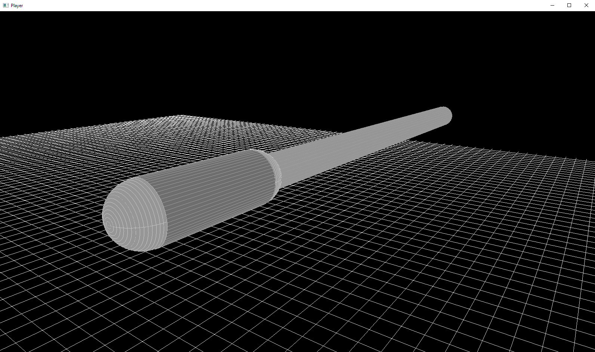
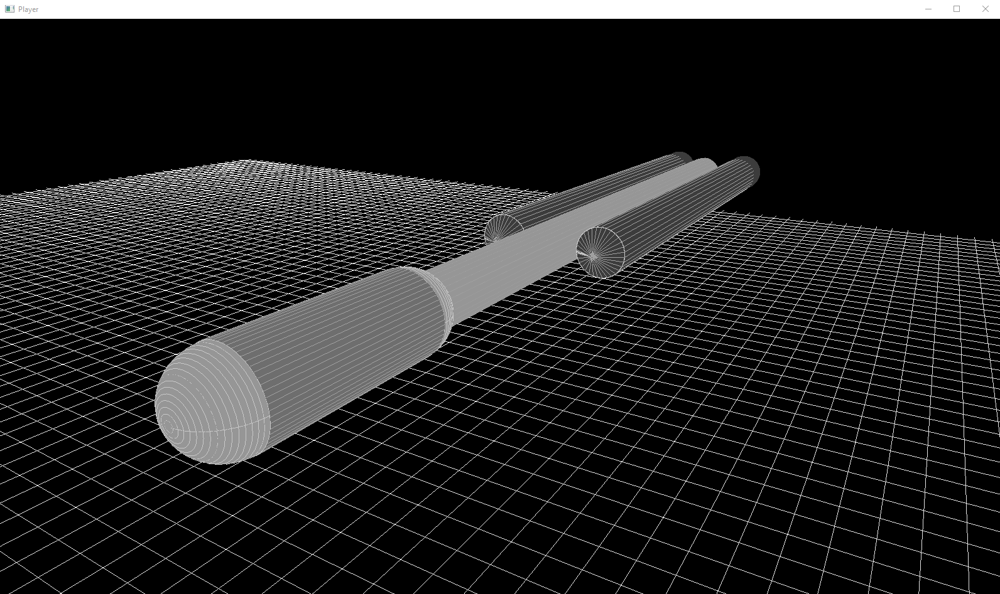
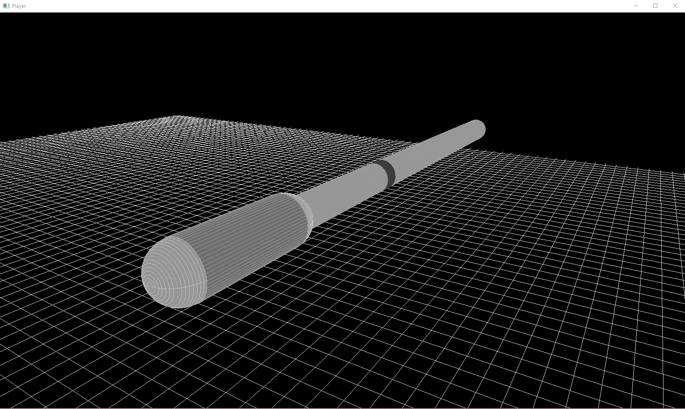
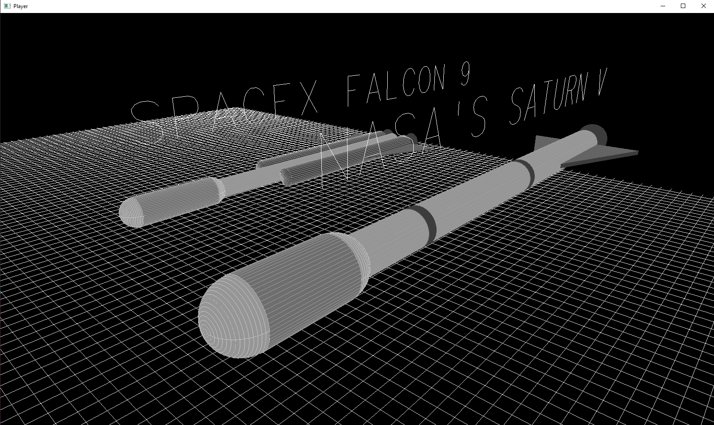

# RocketGL
Basic rocket physics library, operates on the basis of polymorphism across different rocket component sub-classes, with the evaluation of rocket variables varying depending on what the focus component is (since different components factor in different variables).
## Rendering
Uses a custom figure rendering library to render 3d figures with GLUT, rocket component rendering is done in class libraries
## To-do
This is still a VERY experimental phase, much of the functionality is not equipped for wide range use yet.
Many of the functions of the rocket classes are not yet implemented, those will be added with time, this is just a first version
Note: main.cpp is just an implementation, not a part of the library
# A Basic Demo:
Note: you must have your own OpenGL drawing loop implemented, this code should be inserted into that. OpenGL drawing functions will not be mentioned here.
To start rendering and modeling a rocket, the first thing you need to do is initialize a ```fullrocket``` object:

======
```cpp
fullrocket myrocket;
```
======

Though you can technically initialize with a constructor, it is highly recommended that you set variables afterwards to truncate and simplify.
Now the fullrocket class is defined as such:

======
```cpp
class fullrocket {
public:
    std::string name;
    rocket rbody;
    nozzle rnozzle;
    stage rstaging;
    aerodynamics rfins;
    tip rpayload;
    double calcBoosterMass(void);
};
```
======

Where you have all the other rocket component sub-classes loaded into one class to house and make it easier to organize all your rocket data.
Now note that any and all functions in the fullrocket class will be there for the purpose of inter-component calculations. For now, let's focus
on the ```rbody``` object. This object should be your MAIN rocket body object, even though the other objects include the rocket class as a parent class
as well. Why? Well the function of the subclasses is to mainly stick with their own variables and members, but they have the rocket class as a parent
because the subclass will occasionally use broader variables that belong in a broader, more general rocket class (for example, exhaust velocity and thrust would be in the rocket class, and the staging sub-class would on occasion borrow those for individual calculations, while the staging class members still remain specific).
Now, let's say we want to get a rocket cylinder/body ready for rendering or modeling, we would do it something like this:

======
```cpp
fullrocket myrocket;
//Let's set some basic variables
myrocket.rbody.height = 70; //in METERS, we are always going by the metric system
myrocket.rbody.radius = 1.88f; //again, meters
myrocket.rbody.hullthickness = 0.0047; //hull thickness is used for more accurately calculating volume or density, but it also represent's hull thickness in meters
myrocket.rbody.totalbodymass = 6000000; //this is a virtual factor relating to the hull thickness, but is not actually a thickness, so DO NOT CONFUSE IT AS SUCH
myrocket.rbody.accuratebodymass = 1420788; //THIS is the accurate total mass for the rocket, in kg
myrocket.rbody.material = STAINLESSSTEEL; //defined in metrics.hpp
myrocket.rbody.rcylinder.xcoord = -35.0f; * METER; //Just a sample coordinate, but it does implement the METER unit, which you should do too
myrocket.rbody.rcylinder.ycoord = -20.0f; * METER;
myrocket.rbody.rcylinder.zcoord = -3.0f; * METER;
myrocket.rbody.rcylinder.vertexnum = 90; //Sharpness of the rocket body cylinder. Basically the more you have, the smoother it will render
```
======

Now we have a fully minimal rocket body set for rendering. Note that you can experiment with calculating the height of the rocket by taking away that height and leaving the other parameters, and instead invoking ```myrocket.rbody.calcBodyHeight()``` to calculate the height. That way you can experiment with adding different materials, new widths, mass, all that. Moving on, let's look at rendering the rocket cylinder:

======
```cpp
fullrocket myrocket;
myrocket.rbody.height = 70; 
myrocket.rbody.radius = 1.88f; 
myrocket.rbody.hullthickness = 0.0047; 
myrocket.rbody.totalbodymass = 6000000;
myrocket.rbody.accuratebodymass = 1420788;
myrocket.rbody.material = STAINLESSSTEEL;
myrocket.rbody.rcylinder.xcoord = -35.0f * METER;
myrocket.rbody.rcylinder.ycoord = -20.0f * METER;
myrocket.rbody.rcylinder.zcoord = -3.0f * METER;
myrocket.rbody.rcylinder.vertexnum = 90;
//Render the rocket here:
GLenum renderprimtype = GL_TRIANGLE_STRIP; //GLUT primitive type for figure rendering
GLenum payloadprimtype = GL_POLYGON;
myrocket.rpayload.height = 12.0f; //Just a sample height for the rocket payload/tip
myrocket.rbody.renderRocketCylinder(renderprimtype); //Render rocket cylinder/body with the primitive type and rocket class function
myrocket.rpayload.renderRocketTip(payloadprimtype, myrocket.rbody); //Give the payload the cylinder body and the primitive type to render the tip accordingly
```
======

Once you've done that, you should have gotten a basic rocket body and tip. Congrats, you rendered your first basic rocket!

Thing is, you can only do so much with a simple rocket cylinder, let's look at some more things we can do with the rocket.
## Staging
RocketGL supports the rendering of two types of staging: serial and parallel. Think of parallel staging as rocket staging
involving boosters, and serial staging is just the opposite of that, consisting of one large whole rocket with sub-sections
If you have a rocket with multiple stages, then you need to get all the required data about the rocket's masses in each stage
before you try rendering the stages. Note that the staging in your code is represented by a 0-indexed array, so if you wanted
to change the mass of the first stage, you would use the zeroeth stage and not the first one. We can start off with something like this:

======
```cpp
//FROM PREVIOUS CODE
myrocket.rbody.height = 70;
myrocket.rbody.radius = 1.83f;
myrocket.rbody.hullthickness = 0.0047;
myrocket.rbody.accuratebodymass = 1420788;
myrocket.rbody.totalbodymass = 6000000;
myrocket.rbody.material = STAINLESSSTEEL;
myrocket.rbody.rcylinder.xcoord = -35.0f * METER;
myrocket.rbody.rcylinder.ycoord = -20.0f * METER;
myrocket.rbody.rcylinder.zcoord = -3.0f * METER;
myrocket.rbody.rcylinder.vertexnum = 90;
GLenum renderprimtype = GL_TRIANGLE_STRIP; //GLUT primitive type for figure rendering
GLenum payloadprimtype = GL_POLYGON;
myrocket.rpayload.height = 12.0f; //Just a sample height for the rocket payload/tip
//NEW STUFF
myrocket.rstaging.payloadmass = 100; //Payload fairing mass, KG
myrocket.rstaging.propellantmass[0] = 1222800; //The propellant mass of the first stage, also kg
myrocket.rstaging.propellantmass[1] = 107200; //Propellant mass of the second stage
myrocket.rstaging.structuremass[0] = 51000; //Structural mass of the first stage
myrocket.rstaging.structuremass[1] = 4500; //Structural mass, second stage
myrocket.rstaging.specificimpulse = 312; //Specific impulse needed for delta-v calculation. Note that for now if any coming stage has a change in Isp, this variable must be changed.
 ```
====== 
 
 Using the info we have here, we can finish up the mass data requirements by calling some functions:
 
 ======
 ```cpp
std::cout << myrocket.rstaging.calctotalmass(0) << std::endl; //only necessary if total mass for these stages haven't been manually specified, and you need to use the mass info to gather it
std::cout << myrocket.rstaging.calctotalmass(1) << std::endl; //the calctotalmass function factors in stuff specifically for mass ratio calculation. If you want a change, go to rocketdef.cpp
```
======

And now, we have all the data for a two-stage rocket done. If you want more stages, you need to do the same things we did for the propellant and structure masses above, just more times. To render our staging, we can do the following (after all the code we wrote above): 

======
```cpp
myrocket.rbody.renderRocketCylinder(renderprimtype); //If you already have this line don't write it again
myrocket.rpayload.renderRocketTip(payloadprimtype, myrocket.rbody); //If you already have this line don't write it again
myrocket.rstaging.renderStaging(STAGINGTYPEPARALLEL, myrocket.rbody); //Give staging type and the rocket body for mapping the stage onto the rocket accordingly
```
======


Now with the ```STAGINGTYPEPARALLEL``` mode on, you should see a rocket with boosters on the side with accurate sizes and masses calculated using the data we gave just now. However, if you looked to do a serial staged rocket, all you would need to do is change the mode to ```STAGINGTYPESERIAL```. Try it out and you can see how a booster-controlled rocket would look and how a serial-staged rocket would look with the same exact parameters, and you might see why one choice is better than the other.

Now one of the biggest purposes of staging and jettisoning parts of the rocket that are no longer necessary is to change up the mass ratio of the rocket and in turn change the delta-v of the rocket, which is a very useful thing to do when you're shifting course from one maneuver to the other (for example, there will be a different delta-v for reaching LEO than there will be for going from Earth orbit to the Moon). This is why it can be so useful for rocket launch simulations. To calculate mass ratio, total mass, or delta-v, you can simply call:

======
```cpp
std::cout << myrocket.rstaging.calctotalmass(0) << std::endl;//Calculates the total mass of the first stage of the rocket
std::cout << myrocket.rstaging.calcmassratio(0) << std::endl; //Calculates the mass ratio for the first stage of the rocket
std::cout << myrocket.rstaging.calcdeltav(0) << std::endl; //Calculates the delta-v for the first stage of the rocket
```
======

IMPORTANT NOTE: the serial staging vs the parallel staging is not completely accurate, since RocketGL currently doesn't take multi-thruster boosters and rockets into account yet when it comes to rendering the staging, therefore it renders a serial staged rocket and a parallel staged rocket assuming they both provide the same amount of thrust (IF you want to make this more realistic, you can try changing the specific impulse using knowledge about exhaust velocity and weight flow to conform to a booster-powered rocket vs one without boosters)
## Aerodynamics
When modeling or constructing a rocket, it is always important to calculate the aerodynamic forces that surround and impact it on its flight. We can model a rocket's aerodynamic components (such as fins) and calculate the forces acting upon the rocket using the ```aerodynamics``` subclass:

======
```cpp
myrocket.rfins.finheight = 25.0f; //Fin height along the rocket body, meters
myrocket.rfins.finwidth = 10.0f; //Fin width extendind outward from the rocket
myrocket.rfins.finthickness = 0.2f; //Fin thickness, usually not too thick, also in meters
myrocket.rfins.renderFins(true, myrocket); //Now you can simply render it!
```
======

Now we have rocket fin dimensions for rendering set up, but visuals aren't everything, we want to be able to use the fins we designed to calculate how much lift and drag we would be generating at a certain height. To do this, we can do the following:

======
```cpp
myrocket.rfins.atmosphericDensity = 0.00052; //Atmospheric density in kg/m^3. You can try to go with just altitude, but it isn't entirely accurate just yet
myrocket.rfins.averagevelocity = (myrocket.rstaging.calcdeltav(0)/2); //Just trying to go with a somewhat related velocity for the averagevelocity variable. unit is meters/sec
myrocket.rfins.dragCoefficient = 0.74; //Drag coefficient can usually be determined from the shape of the tip of the surface coming in contact with the air or wind, no unit
myrocket.rfins.liftCoefficient = 0.85; //Lift coefficients are usually determined experimentally, in this case I'll just put a 0.85, no unit
```
======

You can easily calculate drag force and lift force from this by calling the following functions:

======
```cpp
std::cout << myrocket.rfins.calcliftforce(1000) << std::endl; //The 1000 is just a placeholder, if you don't define atmospheric information, that's where you would supply an altitude
std::cout << myrocket.rfins.calcdragforce(1000) << std::endl; //Same situation here
```
======

And of course, you can render your rocket fins like so:

======
```cpp
myrocket.rfins.renderFins(true, myrocket); //Now the first argument asks if you use parallel staging, because fin configuration will change if that is the case. The second argument is simply the main fullrocket object that you are using.
```
======

If we were to run the main.cpp file and render a basic, cylindrical model of the Saturn V and the Falcon Heavy rockets, here is what it would look like with the staging and aerodynamics and payload all put together:

